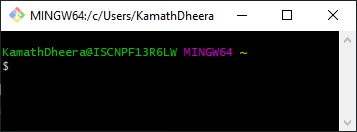
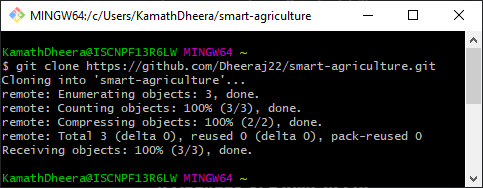
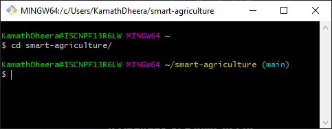
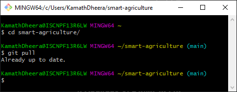
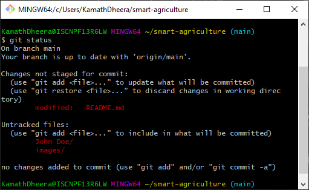
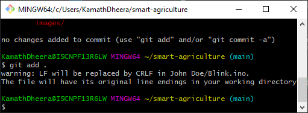
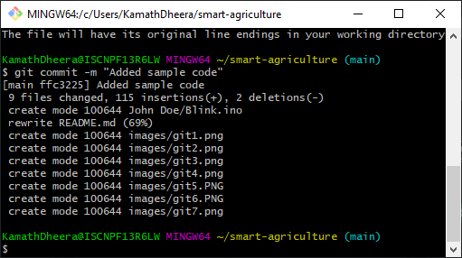
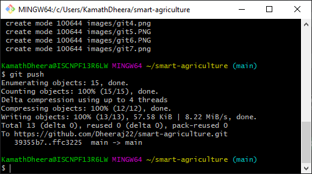
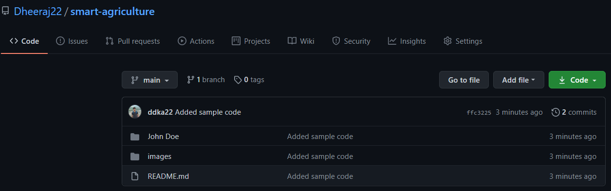

# smart-agriculture
Smart Agriculture Project for Cyber Physical Systems course.

### Hardware Pre-requisites
* [Arduino Uno Board](https://www.amazon.in/Arduino-UNO-board-DIP-ATmega328P/dp/B008GRTSV6) - Main Microcontroller for sensor integration and processing
* [Ultrasonic Sensor](https://robu.in/product/hc-sr04-ultrasonic-range-finder/?gclid=Cj0KCQiA-aGCBhCwARIsAHDl5x-SA2CdPxEqjyiDGrX1pLh4unL09V3-hP1ZEr5rkmzE-VPyPopmGu8aAovxEALw_wcB) - For distance measurements particulary water level of the tank
* [PH Sensor](https://www.electronicscomp.com/analog-ph-sensor-kit-for-arduino?gclid=Cj0KCQiA-aGCBhCwARIsAHDl5x_yCftqmTv63b7V6m3Pgp0hXnWhars9fBxy4pccBdaWYKHlTXjoQqgaAlzaEALw_wcB) - For measuring the PH Level of the soil
* [Temperature/Humidity Sensor](https://www.electronicscomp.com/dht11-temprature-humidity-sensor-module-india?gclid=Cj0KCQiA-aGCBhCwARIsAHDl5x_LVh2CjXTFdwdG0JsFVv5UIDyRpRiZlito8L4-PIaHpaYzN90RUY4aAsKnEALw_wcB) - For measuring the temperature and humidity of the surrounding
* [Ambient Light Sensor](https://www.electronicscomp.com/ldr-light-sensor-module-india?gclid=Cj0KCQiA-aGCBhCwARIsAHDl5x_o3Oog8AlarSK8qfNBAgZHpufpf_sQvhIHLIg1xKs_Hnf-wcUPVEoaAtV-EALw_wcB) - For detecting ambient light of the surrounding
* [Solonoid Valve](https://www.hnhcart.com/products/solenoid-valve-1-2-dc-3-6v-water-control-electric-pulse-solenoid-valve?variant=37522859229358&currency=INR&utm_medium=product_sync&utm_source=google&utm_content=sag_organic&utm_campaign=sag_organic&utm_campaign=gs-2020-11-23&utm_source=google&utm_medium=smart_campaign) - For controlling the water flow
* [GSM Module](https://www.electronicscomp.com/sim800l-v2-5v-wireless-gsm-gprs-module-quad-band-with-antenna?gclid=Cj0KCQiA-aGCBhCwARIsAHDl5x-fi_tKI1Y1cgQ6LWnCPEQbEAzpfA_C7bFBDWx2DbYMkGKzmXEmnycaAq-GEALw_wcB) - For integrating the SIM card and sending messages
* [ESP8266 Module](https://www.electronicscomp.com/esp8266-esp01-wifi-module?gclid=Cj0KCQiA-aGCBhCwARIsAHDl5x9s-oPnow1cWleGh7N9C2HWGTBHztebjSHQulG9WLH7teTIofUJePQaAr0wEALw_wcB) - For WiFi connectivity and making RESTful API calls

### Software Pre-Requisites
* [Arduino IDE](https://www.arduino.cc/en/software) - For developing arduino firmware
* [Git Bash](https://git-scm.com/downloads) - For version control of this project

### Setup Instructions
1. Install [Git Bash](https://git-scm.com/downloads)
2. Once installed, search Git bash in Windows search and run the application
    
3. Clone the repository to get the project files into your local system by running the following command:

    ``` >> git clone https://github.com/Dheeraj22/smart-agriculture.git ```

    

4. Navigate to the project directory by running the command:

    ``` >> cd smart-agriculture ```

    

5. You are now ready to use the project


### Making a change

1. Before you start, always check if there was any recent update from your teamates by pulling the latest code:

    ``` >> git pull ```

    

    If there is any change, it will be pulled into your local system. If not, you should see the message "Already up to date" as shown above. 

2. You can add file/folders and absolutely any change you want to this repository. But to not thread or affect other's code, create a folder with your name in this directory. Then add corresponding files into that. 

    * For example, create a directory named "John Doe". 
    

    * Now create your arduino sketch in Arduino IDE. Once tested, copy and paste it inside this folder. 
    

3. Once all the code is tested and you are ready to push the changes for everyone to see, run the following commands:

    * Pull latest changes if any from teammates
    
        ``` >> git pull ```

    * Run a status check to see what all files and folders you have added/modified:
    
        ``` >> git status ```
        
        

    * Add the new/modified files into staging area (use the dot at the end of the command to include all files/folders automatically):

        ``` >> git add . ```

        

    * Commit the changes by adding a message with what changes were done.

        ``` >> git commit -m "Added sample code" ```

        

    * Push the code to the public server for all your teammates to view and access.

        ``` >> git push ```

        

4. Check online by refreshing the page to see if your project changes reflect.

    


